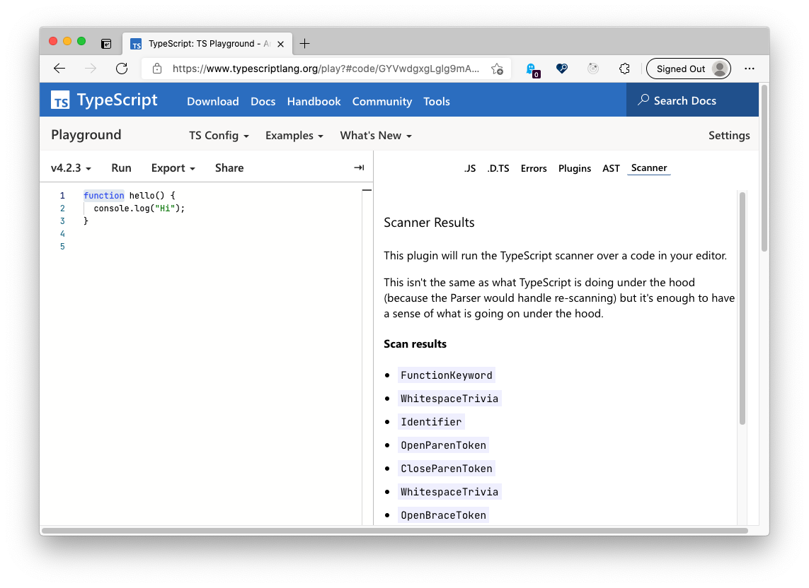

## TypeScript Playground Plugin

Shows what the TypeScript Scanner reads for your TS/JS.



## Running this plugin

- [Click this link](https://www.typescriptlang.org/play?install-plugin=playground-ts-scanner) to install

or

- Open up the TypeScript Playground
- Go the "Plugins" in the sidebar
- Look for "Plugins from npm"
- Add "playground-ts-scanner"
- Reload the browser

Then it will show up as a tab in the sidebar.

## Contributing

See [CONTRIBUTING.md](./CONTRIBUTING.md) for the full details, however, TLDR:

```sh
git clone ...
yarn install
yarn start
```

Then tick the box for starting plugin development inside the TypeScript Playground.
